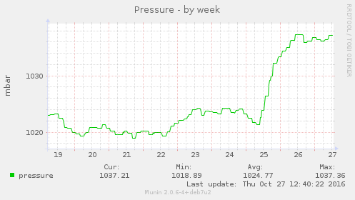

# openhab\_

A [munin](http://http://munin-monitoring.org/) plugin to read
[openhab](http://www.openhab.org/) item states

## building

Getting

    go get github.com/vetinari/munin-openhab

Updating

    go get -u github.com/vetinari/munin-openhab

Building for same architecture

    go build -o openhab_ github.com/vetinari/munin-openhab

Building for other architecture, select your
[target arch](http://dave.cheney.net/2015/08/22/cross-compilation-with-go-1-5),
e.g. linux arm:

    env GOOS=linux GOARCH=arm go build -v -o openhab_ github.com/vetinari/munin-openhab

Install by copying the `openhab_` binary to the munin plugin directory on
the target host.

## config

To monitor a an item link openhab\_{item} to the plugin. E.g.

    ln -s /usr/share/munin/plugins/openhab_ /etc/munin/plugins/openhab_OUT_Temperature

will monitor the `OUT_Temperature` item.

Currently `Number`, `Dimmer`, `Switch` and `Contact` items are supported. Both `Switch`es and 
`Contact`s are mapped to 1 for `on` / `open` and 0 for `off` / `closed`. `Number`s are returned
as is, `Dimmer`s return their percentage value.


## plugin config
This plugin needs manual configuration in a file in `/etc/munin/plugin-conf.d/`

```
[openhab_OUT_Pressure]
env.graph_scale no
env.graph_args --alt-autoscale --alt-y-grid
env.vlabel mbar
env.title Pressure
env.label pressure

[openhab_OUT_Humidity]
env.server http://localhost:8080
env.graph_args -l 0 -u 100
env.title Relative Humitdity Outside
env.vlabel %rH
env.label relative Humidity
```

The `env.graph_args` in the *openhab\_OUT\_Pressure* section result in a graph
like



otherwise it would be quite flat, even with `env.graph_scale no`.

## Groups
The plugin supports groups as items. Only the items directly below the
given group are used. Group items in an openHAB items file like
```
Group grpHumidity
Number   OUT_Humidity         "Humidity [%d %%]"    (grpWeather, grpHumidity)  {weather="locationId=home, type=atmosphere, property=humidity"}
Number EG_LivingRoom_Humidity "Humidity [%.1f %%]" (EG_LivingRoom, grpHumidity) {tinkerforge="name=hum_living_room"}
```
Add the `grpHumitdity` as item to the plugin config
```
[openhab_grpHumidity]
env.server http://localhost:8080
env.title Relative Humitdity
env.graph_args -l 0 -u 100
env.graph_scale no
env.vlabel %rH
env.label_OUT_Humidity outdoor
env.label_EG_LivingRoom_Humidity indoor, living room
```
and create a symlink like

    ln -s /usr/share/munin/plugins/openhab_ /etc/munin/plugins/openhab_grpHumidity

As seen in the example above, the label uses `label_` and item name.

The `env.server` setting defaults to `http://localhost:8080`

### ignoring items in a group
Items in a group may be ignored by setting the `env.item_filter REGEXP` for
a section, e.g.
```
[openhab_grpSwitches]
env.item_filter SwitchB$
```
would ignore items which end with "SwitchB".
